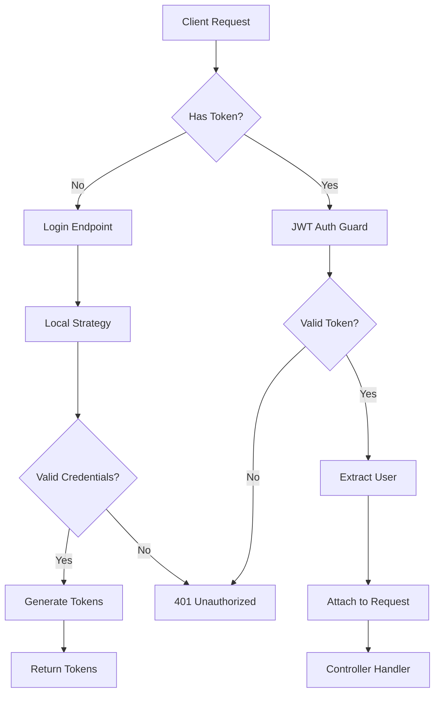

# Kalos Backend Architecture

## Overview

Kalos Backend is built using a modern, scalable architecture leveraging NestJS framework with TypeScript. This document outlines the architectural decisions, patterns, and structure of the application.

## Table of Contents

- [Architecture Principles](#architecture-principles)
- [Technology Stack](#technology-stack)
- [Application Layers](#application-layers)
- [Module Structure](#module-structure)
- [Data Flow](#data-flow)
- [Security Architecture](#security-architecture)
- [Database Design](#database-design)
- [API Design](#api-design)

## Architecture Principles

### 1. Separation of Concerns

Each module handles a specific domain concern, making the codebase maintainable and scalable.

### 2. Dependency Injection

Leveraging NestJS's built-in DI container for loose coupling and testability.

### 3. API Versioning

All endpoints are versioned (e.g., `/v1/auth/login`) to maintain backward compatibility.

### 4. Single Responsibility

Each class/module has one clear purpose, following SOLID principles.

### 5. DRY (Don't Repeat Yourself)

Shared functionality is abstracted into reusable modules and services.

## Technology Stack

### Core Framework

- **NestJS 11.x** - Progressive Node.js framework
- **Fastify** - High-performance web server
- **TypeScript 5.x** - Type-safe JavaScript

### Database & ORM

- **PostgreSQL** - Primary database
- **Prisma 7.x** - Modern ORM with type safety
- **Prisma Migrate** - Database migrations

### Authentication

- **Passport.js** - Authentication middleware
- **JWT** - Token-based authentication
- **bcrypt** - Password hashing

### Validation

- **class-validator** - Decorator-based validation
- **class-transformer** - Object transformation

### Testing

- **Jest** - Test runner and assertion library
- **Supertest** - HTTP testing

### Development Tools

- **ESLint** - Code linting
- **Prettier** - Code formatting
- **pnpm** - Fast, efficient package manager

## Application Layers

```
┌─────────────────────────────────────┐
│         Controllers Layer           │  ← HTTP/API Entry Points
├─────────────────────────────────────┤
│      Guards & Middleware Layer      │  ← Authentication, Validation
├─────────────────────────────────────┤
│         Services Layer              │  ← Business Logic
├─────────────────────────────────────┤
│       Repositories Layer            │  ← Data Access (Prisma)
├─────────────────────────────────────┤
│         Database Layer              │  ← PostgreSQL
└─────────────────────────────────────┘
```

### Controllers Layer

- Handle HTTP requests and responses
- Route definitions
- Input validation (DTOs)
- Apply guards and decorators
- Delegate to services

### Guards & Middleware Layer

- Authentication (JWT)
- Authorization (Role-based)
- Request validation
- Rate limiting
- Logging

### Services Layer

- Core business logic
- Data transformation
- External service integration
- Error handling
- Transaction management

### Repositories Layer

- Database queries (via Prisma)
- Data persistence
- Query optimization
- Relationship management

## Module Structure

```
src/
├── config/                     # Global configuration
│   ├── config.module.ts
│   └── config.service.ts       # Centralized config management
│
├── prisma/                     # Database service
│   ├── prisma.module.ts
│   └── prisma.service.ts
│
├── modules/                    # Feature modules
│   ├── auth/                   # Authentication & Authorization
│   │   └── v1/
│   │       ├── auth.controller.ts
│   │       ├── auth.service.ts
│   │       ├── auth.module.ts
│   │       ├── decorators/      # Custom decorators
│   │       │   └── current-user.decorator.ts
│   │       ├── dto/             # Data transfer objects
│   │       │   └── auth.dto.ts
│   │       ├── guards/          # Auth guards
│   │       │   ├── jwt-auth.guard.ts
│   │       │   ├── jwt-refresh.guard.ts
│   │       │   ├── local-auth.guard.ts
│   │       │   ├── role.guard.ts
│   │       │   └── verified.guard.ts
│   │       └── strategies/      # Passport strategies
│   │           ├── jwt.strategy.ts
│   │           ├── jwt-refresh.strategy.ts
│   │           ├── local.strategy.ts
│   │           ├── google.strategy.ts
│   │           └── facebook.strategy.ts
│   │
│   ├── users/                   # User management
│   │   └── v1/
│   │       ├── users.controller.ts
│   │       ├── users.service.ts
│   │       ├── users.module.ts
│   │       ├── dto/
│   │       │   ├── create-user.dto.ts
│   │       │   └── update-user.dto.ts
│   │       └── entities/
│   │
│   ├── device/                  # Device tracking
│   │   └── v1/
│   │       ├── device.module.ts
│   │       └── device.service.ts
│   │
│   ├── verification/            # Verification workflows
│   │   └── v1/
│   │       ├── verification.controller.ts
│   │       ├── admin-verification.controller.ts
│   │       ├── verification.service.ts
│   │       ├── verification.repository.ts
│   │       ├── verification.module.ts
│   │       └── dto/
│   │
│   ├── logging/                 # Audit & auth logging
│   │   ├── audit.module.ts
│   │   ├── audit.service.ts
│   │   ├── auth-log.module.ts
│   │   └── auth-log.service.ts
│   │
│   └── storage/                 # File storage (S3/local)
│       ├── storage.module.ts
│       ├── storage.service.ts
│       ├── storage.provider.ts
│       └── s3-storage.provider.ts
│
├── app.module.ts               # Root module
└── main.ts                     # Application bootstrap
```

### Module Conventions

Each feature module follows a consistent structure:

1. **Module file** - Declares dependencies and providers
2. **Controller** - Handles HTTP requests
3. **Service** - Contains business logic
4. **DTOs** - Define request/response shapes
5. **Guards** - Authentication/authorization logic
6. **Decorators** - Custom parameter decorators

## Data Flow

### Request Flow (Example: User Login)

```
1. HTTP POST /v1/auth/login
   ↓
2. AuthController.login(@Body() loginDto)
   ↓
3. @UseGuards(LocalAuthGuard)
   → Validates credentials via LocalStrategy
   ↓
4. AuthService.login(user)
   → Generate JWT tokens
   → Create refresh token
   → Log authentication attempt
   ↓
5. DeviceService.createOrUpdateDevice()
   → Track device information
   ↓
6. AuthLogService.logSuccess()
   → Record successful login
   ↓
7. Response: { accessToken, refreshToken, user }
```

### Authentication Flow



## Security Architecture

### Authentication Strategy

1. **Local Authentication**
   - Email/phone + password
   - Password hashed with bcrypt (10 rounds)
   - Rate limiting on failed attempts

2. **JWT Tokens**
   - **Access Token**: Short-lived (15 minutes)
   - **Refresh Token**: Long-lived (30 days)
   - Stored securely in HTTP-only cookies

3. **OAuth Integration**
   - Google OAuth 2.0
   - Facebook Login
   - Automatic account linking

### Authorization Levels

```typescript
enum Role {
  USER      // Regular users
  CREATOR   // Content creators (verified)
  VENDOR    // Vendors (verified)
  ADMIN     // System administrators
}
```

### Guards

1. **JwtAuthGuard** - Validates access token
2. **JwtRefreshGuard** - Validates refresh token
3. **RoleGuard** - Checks user role
4. **VerifiedGuard** - Ensures user is verified

### Security Best Practices

- All passwords hashed with bcrypt
- JWT secrets in environment variables
- HTTP-only cookies for token storage
- CORS configuration
- Input validation on all endpoints
- SQL injection prevention via Prisma
- Rate limiting (TODO)
- Request size limits

## Database Design

### Entity Relationship Diagram

```
User
├── id (PK, UUID)
├── email (unique)
├── phone (unique)
├── passwordHash
├── role (USER|VENDOR|CREATOR|ADMIN)
├── isVerified (boolean)
├── Relationships:
│   ├── devices (1:N)
│   ├── stylePreferences (1:N)
│   ├── verificationRequests (1:N)
│   ├── authLogs (1:N)
│   └── auditLogs (1:N)

Device
├── id (PK, UUID)
├── userId (FK → User)
├── deviceId (string)
├── refreshTokenHash
├── lastSeenAt
└── Unique: (userId, deviceId)

Style
├── id (PK, UUID)
├── name (unique)
├── description
└── users (M:N via UserStylePreference)

UserStylePreference
├── id (PK, UUID)
├── userId (FK → User)
├── styleId (FK → Style)
├── score
└── Unique: (userId, styleId)

VerificationRequest
├── id (PK, UUID)
├── userId (FK → User)
├── type (CREATOR|VENDOR)
├── status (PENDING|APPROVED|REJECTED)
├── payload (JSON)
├── adminId
├── reviewNotes
├── Relationships:
│   └── attachments (1:N)

VerificationAttachment
├── id (PK, UUID)
├── requestId (FK → VerificationRequest)
├── path
├── filename
└── mimeType

AuditLog
├── id (PK, UUID)
├── userId (FK → User)
├── adminId
├── action
├── meta (JSON)
├── ip
└── userAgent

AuthLog
├── id (PK, UUID)
├── userId (FK → User)
├── identifier (email/phone)
├── outcome
├── ip
├── userAgent
└── deviceId
```

### Database Conventions

1. **Primary Keys**: UUID v4 for all tables
2. **Timestamps**: `createdAt`, `updatedAt` on all models
3. **Soft Deletes**: Not implemented (can be added)
4. **Indexes**: On frequently queried fields
5. **Constraints**: Foreign keys with cascading rules

## API Design

### REST Conventions

```
GET    /v1/resource         # List resources
GET    /v1/resource/:id     # Get single resource
POST   /v1/resource         # Create resource
PATCH  /v1/resource/:id     # Update resource (partial)
PUT    /v1/resource/:id     # Replace resource (full)
DELETE /v1/resource/:id     # Delete resource
```

### Versioning

All endpoints are versioned with URI versioning:

- Current version: `/v1/*`
- Future versions: `/v2/*`, `/v3/*`

### Response Formats

#### Success Response

```json
{
  "id": "uuid",
  "email": "user@example.com",
  "role": "USER",
  "createdAt": "2024-01-01T00:00:00.000Z"
}
```

#### Error Response

```json
{
  "statusCode": 400,
  "message": "Validation failed",
  "error": "Bad Request",
  "details": [
    {
      "field": "email",
      "message": "Invalid email format"
    }
  ]
}
```

### HTTP Status Codes

- `200 OK` - Successful GET, PATCH, PUT
- `201 Created` - Successful POST
- `204 No Content` - Successful DELETE
- `400 Bad Request` - Validation error
- `401 Unauthorized` - Authentication required
- `403 Forbidden` - Insufficient permissions
- `404 Not Found` - Resource not found
- `409 Conflict` - Resource conflict (duplicate)
- `500 Internal Server Error` - Server error

## Performance Considerations

### Database Optimization

- Connection pooling via Prisma
- Efficient queries with proper joins
- Indexes on frequently queried fields
- Pagination for list endpoints

### Caching Strategy

- (TODO) Redis for session storage
- (TODO) Cache frequently accessed data
- (TODO) Rate limiting with Redis

### Scalability

- Stateless design (horizontal scaling)
- Database connection pooling
- Async operations where appropriate
- Efficient error handling

## Future Enhancements

1. **API Documentation**
   - Swagger/OpenAPI integration
   - Interactive API explorer

2. **Real-time Features**
   - WebSocket support
   - Push notifications

3. **Caching Layer**
   - Redis integration
   - Cache invalidation strategy

4. **Monitoring**
   - Application performance monitoring
   - Error tracking (Sentry)
   - Logging aggregation

5. **Rate Limiting**
   - Per-user rate limits
   - IP-based throttling

6. **Background Jobs**
   - Queue system (Bull/BullMQ)
   - Scheduled tasks
   - Email sending

## Deployment Architecture

### Production Setup

```
┌──────────────┐
│ Load Balancer│
└──────┬───────┘
       │
   ┌───┴────┬──────────┐
   │        │          │
┌──▼──┐ ┌──▼──┐    ┌──▼──┐
│App 1│ │App 2│... │App N│  (Horizontal Scaling)
└──┬──┘ └──┬──┘    └──┬──┘
   │      │          │
   └──────┴────┬─────┘
              │
        ┌─────▼──────┐
        │ PostgreSQL │
        │  (Primary) │
        └────────────┘
```

### Environment Separation

- **Development**: Local dev environment
- **Staging**: Pre-production testing
- **Production**: Live environment

## Conclusion

This architecture provides:

- **Scalability**: Horizontal scaling capability
- **Maintainability**: Clear module separation
- **Security**: Multiple layers of protection
- **Performance**: Efficient data access
- **Testability**: Dependency injection and mocking

For questions or suggestions, please refer to CONTRIBUTING.md.
